Updated: December 10, 2018

## Introduction

This lab guide will walk you through the process of creating Autonomous Data Warehouse cloud service. We will also crreate a user in Oracle Machine Learning (OML). We will then upload the dataset in Object StoraGE and will import the notebook in OML.

**_To log issues_**, click here to go to the [github oracle](https://github.com/oracle/learning-library/issues/new) repository issue submission form.

## Objectives

- Create an Autonomous Data Warehouse Cloud Service.
- Download Dataset and notebook.
- Connect and create a user in Oracle Machine Learning (OML).
- Import UnstructuredDataset Notebook in OML. 
- Load data in Object Storage.

## Required Artifacts

- An oracle cloud account with Autonomous Data Warehouse Cloud Service.

### **STEP 1**: Create Autonomous Data Warehouse Cloud Service (ADWC).

- Login into your cloud account. Click on **Menu** and click on **Autonomous Data Warehouse.**

    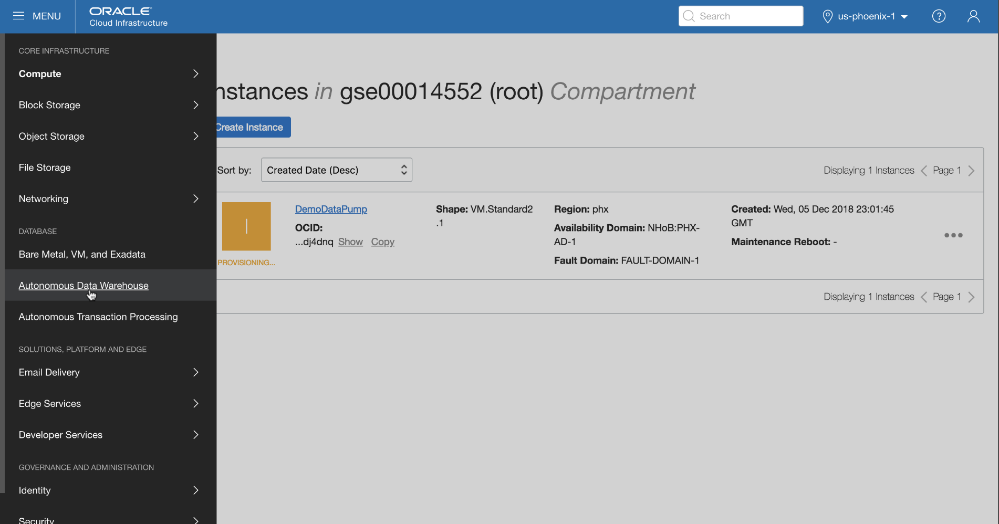

- Click on **Create Autonomous Data Warehouse**.

    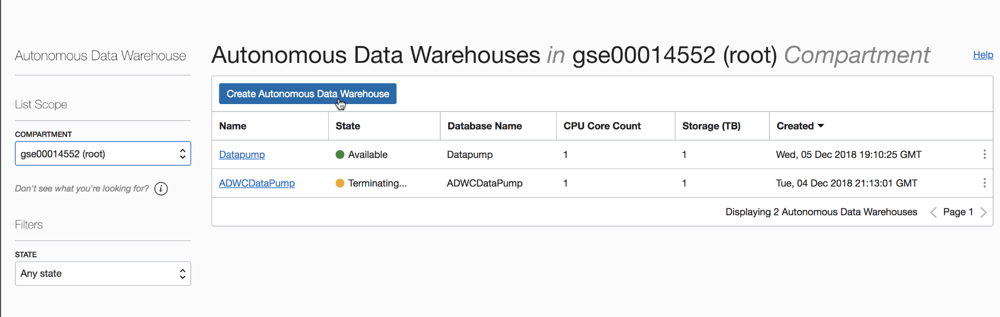

- On Details screen, select the **Compartment**, enter **Display Name and Database Name**. Keep the **CPU Core Count and Storage** as **1**. Finally enter the **Password** and **Confirm Password**.

    - **Note** : Make sure your password doesn't have **"@"**. It might create a problem later.
    
    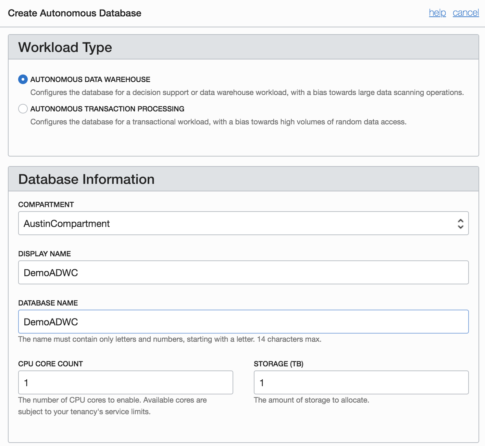
    
    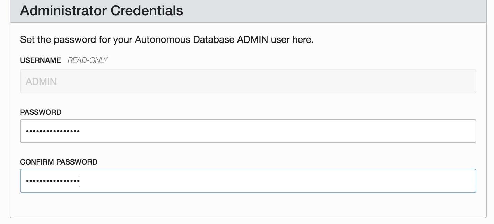

- Select a **License Type** and click on **Create Autonomous Data Warehouse**.
    
    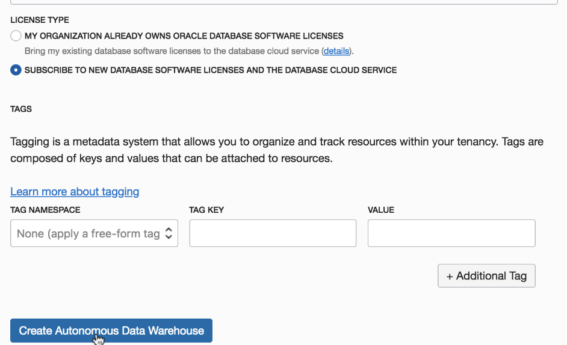
    
### **STEP 2**: Download Dataset and notebook.  
    
- For dataset, download the following zip [Datafiles](images/UnstructuredData/DataFiles.zip)

- For Unstructured Dataset notebook, download the following [UnstructuredDataset](images/UnstructuredData/UnstructuredDataset.json)

### **STEP 3**: Create a user in Oracle Machine Learning (OML) and connect to it.

- Once your ADWC instance is avaiable, click on the ADWC instance that you have just created. Then Click on **Service Console**. 

    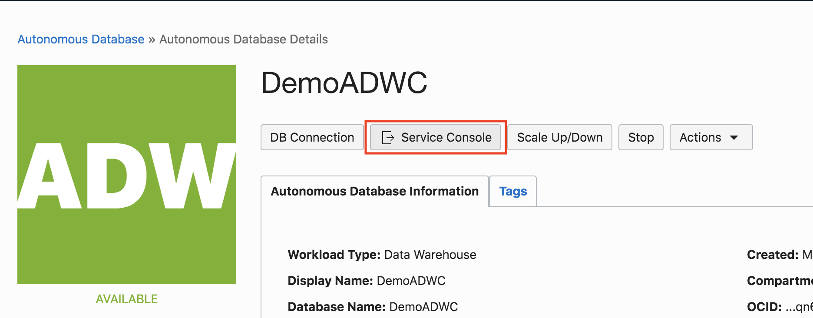

- Then click on **Administration** and then **Manage Oracle ML Users**.

    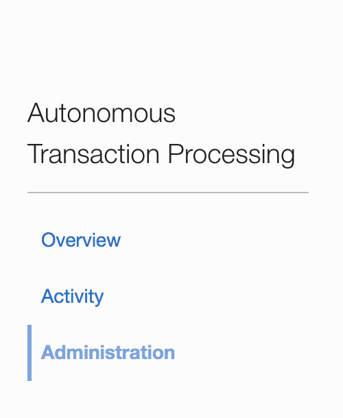
    
    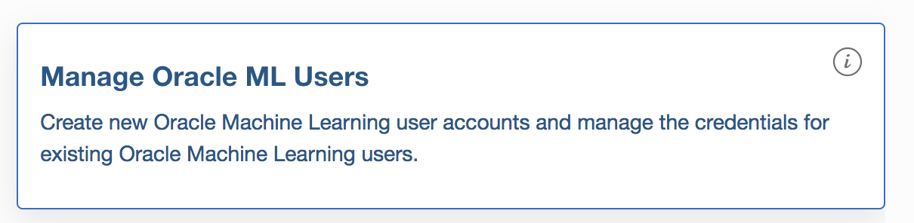
    
- Click on **Create** under Users

    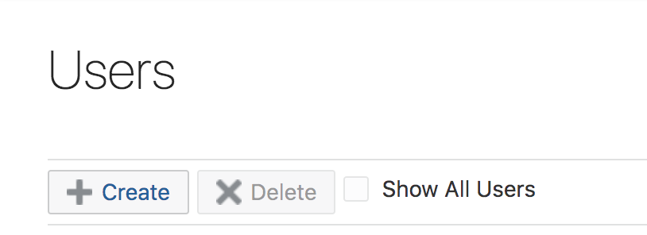

- Create a user. Give **first name, last name, Email Address** and assign a password by unchecking **Generate password and email account.....**
    
    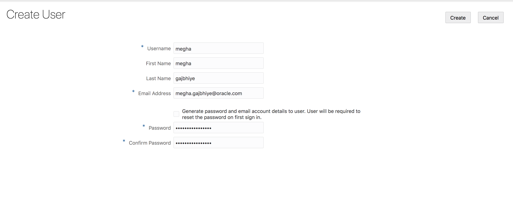

- Click on the home button on the top right corner of the home page 

    

- Login as the user you just created. 

    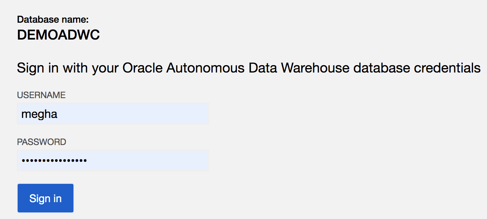
  
    
### **STEP 4**: Import UnstructuredDataset Notebook in OML. 

- After login to OML, click on **Notebooks**.
    
    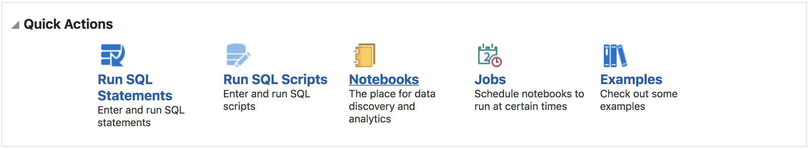

### **STEP 5**: Load data in Object Storage. 

- **Navigate to Object Storage**

    - From the Autonomous Data Warehouse console, pull out the left side menu from the top-left corner and select **Object Storage**. To revisit signing-in and navigating to ADW, please see Lab 1.

      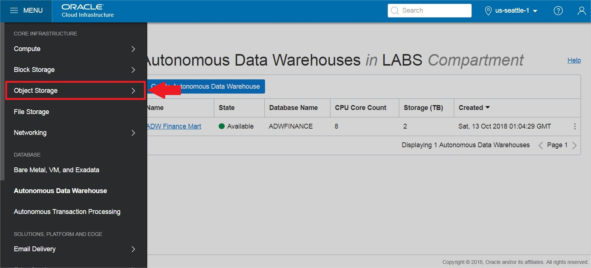

      To learn more about the OCI Object Storage, refer to its <a href="https://docs.us-phoenix-1.oraclecloud.com/Content/GSG/Tasks/addingbuckets.htm" target="_blank">documentation</a> .

    - You should now be on the **Object Storage** page. Choose the compartment in the **Compartment** drop-down if it is not already chosen.
    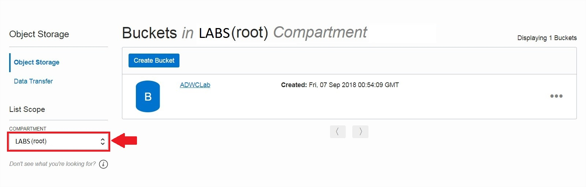

- **Create a Bucket for the Object Storage**

   In OCI Object Storage, a bucket is the terminology for a container of multiple files.

    - Click the **Create Bucket** button:

      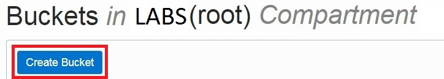

    - Name your bucket **UnstructuredDataset** and click the **Create Bucket** button.

      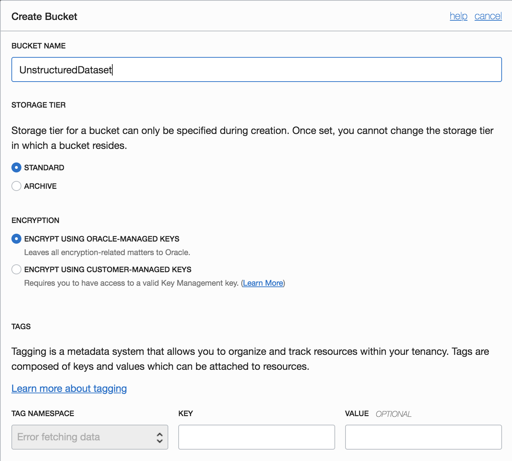

- **Upload Files to Your OCI Object Store Bucket**

    - Click on your **bucket name** to open it and then click on the **Upload Objects** button:

      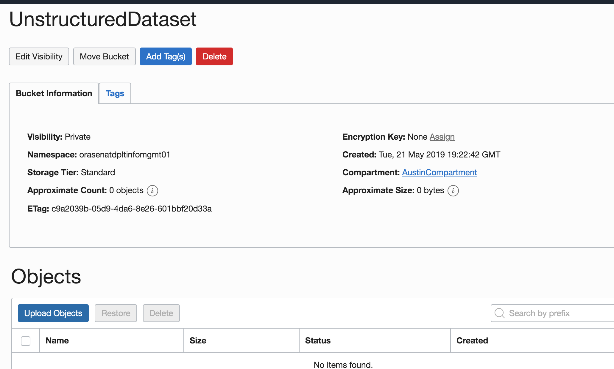

    - Using the browse button or select all the files downloaded in the earlier step, click Upload and wait for the upload to complete:

    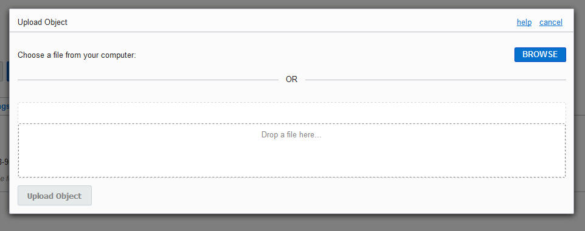

-   Repeat this for all the dataset files you downloaded for this lab.

-   The end result should look like this with all files listed under Objects:

    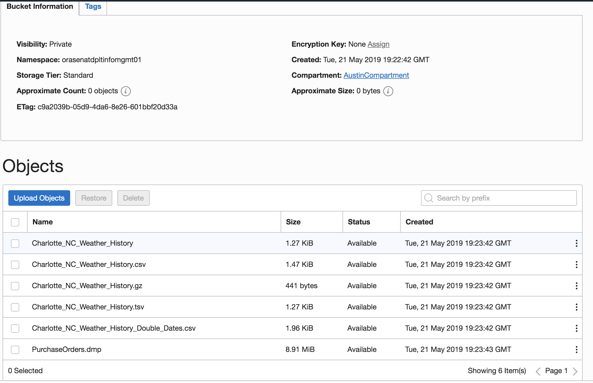

 
