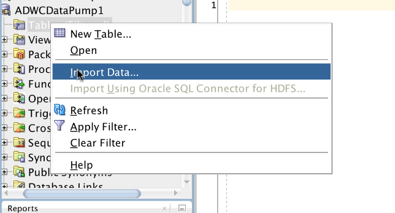
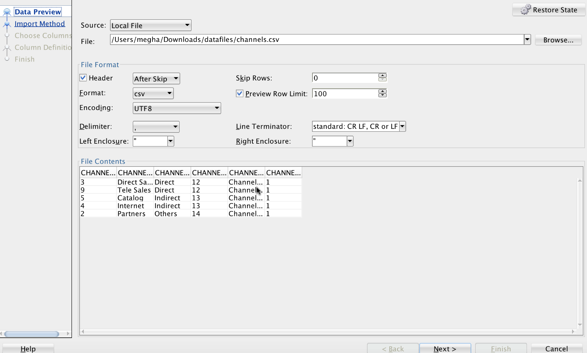
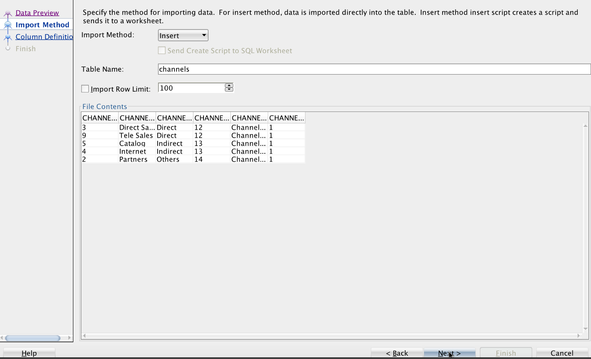
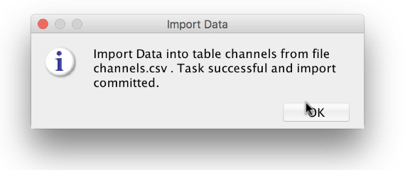
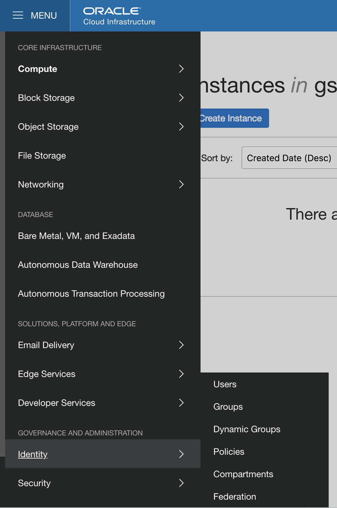
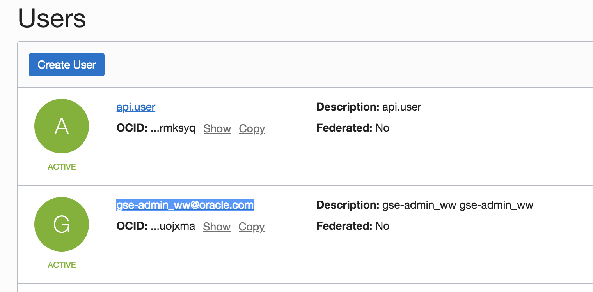
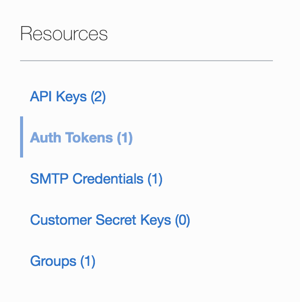
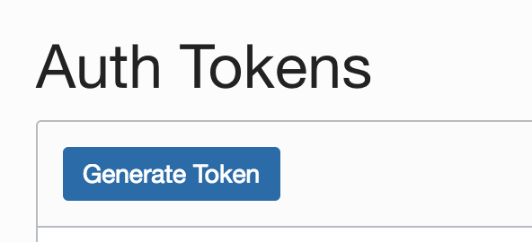
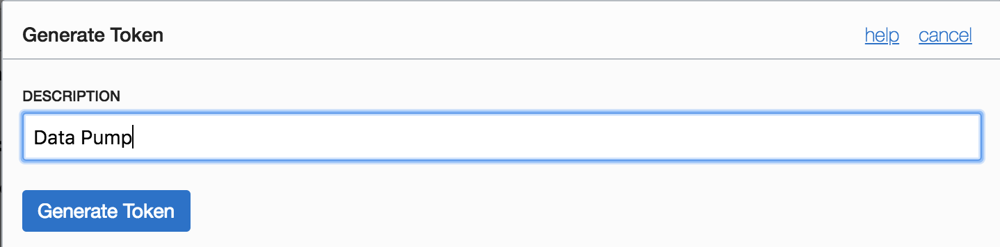

Updated: December 10, 2018

## Introduction

This lab guide will walk you through the process of creating Autonomous Data Warehouse cloud service. We will then connect it to SQL Developer and will import a table from local machine.

**_To log issues_**, click here to go to the [github oracle](https://github.com/oracle/learning-library/issues/new) repository issue submission form.

## Objectives

- Create an Autonomous Data Warehouse Cloud Service.
- Download Dataset and notebook.
- Connect and create a user in Oracle Machine Learning (OML).
- Load data in Object Storage.
- Import UnstructuredDataset Notebook in OML. 

## Required Artifacts

- An oracle cloud account with Autonomous Data Warehouse Cloud Service.

### **STEP 1**: Create Autonomous Data Warehouse Cloud Service (ADWC).

- Login into your cloud account. Click on **Menu** and click on **Autonomous Data Warehouse.**

    

- Click on **Create Autonomous Data Warehouse**.

    

- On Details screen, select the **Compartment**, enter **Display Name and Database Name**. Keep the **CPU Core Count and Storage** as **1**. Finally enter the **Password** and **Confirm Password**.

    - **Note** : Make sure your password doesn't have **"@"**. It might create a problem later.
    
    
    
    

- Select a **License Type** and click on **Create Autonomous Data Warehouse**.
    
    
    
### **STEP 2**: Download Dataset and notebook.  
    
- For dataset, download the following zip [Datafiles](images/UnstructuredData/DataFiles.zip)

- For Unstructured Dataset notebook, download the following [UnstructuredDataset](images/UnstructuredData/UnstructuredDataset.json)

### **STEP 3**: Connect and create a user in Oracle Machine Learning (OML).

- Once your ADWC instance is avaiable, click on the ADWC instance that you have just created. Then Click on **Service Console**. 

    

- Then click on **Administration** and then **Manage Oracle ML Users**.

    
    
    
    
- Click on **Create** under Users

    

- Create a user. Give **first name, last name, Email Address** and assign a password by unchecking **Generate password and email account.....**
    
    

- Click on the home button on the top right corner of the home page 

    

- Login as the user you just created. 

    
    

### **STEP 4**: Load data in Object Storage. 

- Download following file. [Channels](images/UnstructuredData/channels.csv) 

- Right click on **Tables** and click on **Import Data**. 

    

- Leave the **Source** as **Local File**. Open the file just downloaded. 

        
    
- Click on *next* and give *Table Name* as **channels**. Click on **next**, **next** and **finish**.

      
    
- A pop up appears to show data is imported. Click on **OK**.

      

### **STEP 3**: Create credential.
  
- Then click on **Administration** and then **Manage Oracle ML Users**.
    
    - Go to Oracle Compute instance. Click on **Menu**, **Identity**, **Users**.
    
        
        
    - Click on **gse-admin_ww@oracle.com** user.
    
        
    
    - Click on **Auth Tokens**. 
    
          
     
    - Click on **Generate Token**  
     
        
        
    - Give a **Description** and click on **Generate Token**
    
        
    
        Note:  Make sure to save the token in a text file for future reference. 
      
    - Go back to SQLDeveloper and copy paste the following script:
    
      Change the following parameters before copy pasting the script: 
      
      - **username**: `gse-admin_ww@oracle.com`
    
      - **password**: `Generated token`
      
      **Script**: 
      
        BEGIN      
            DBMS_CLOUD.CREATE_CREDENTIAL(
            credential_name => 'DEF_CRED_NAME',
            username => 'gse-admin_ww@oracle.com',
            password => 'Generated Token'
            );
            END;