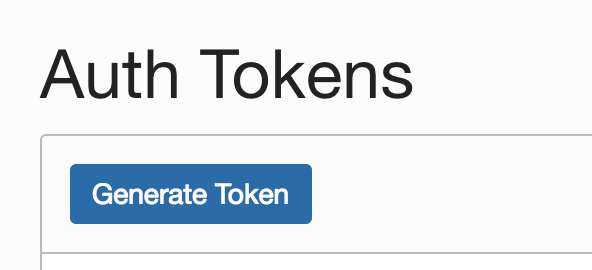

Updated: December 10, 2018

## Introduction

This lab guide will walk you through the process of creating a Compute Linux Instance.

**_To log issues_**, click here to go to the [github oracle](https://github.com/oracle/learning-library/issues/new) repository issue submission form.

## Objectives

- Create credential.

## Required Artifacts

- An oracle cloud account with Autonomous Data Warehouse Cloud Service.
- Dataset uploaded in Object Storage
- Notebook imported in Oracle Machine Learning.

### **STEP 1**: Create a **Credential**.

- **Get Auth token.**

    - Go to Oracle Compute instance. Click on **Menu**, **Identity**, **Users**.
    
      
        
    - Click on your username.
    
      
    
    - Click on **Auth Tokens**. 
    
        
     
    - Click on **Generate Token**  
     
      
        
    - Give a **Description** and click on **Generate Token**
    
      
    
      **Note:  Make sure to save the token in a text file for future reference.** 
 
- **Create Credential** 
      
    - Go back to your Notebook which you just imported in OML.
    
    - Change the following parameters in your first script:
      
      - **username**: `your username`
    
      - **password**: `Generated token`
      
      **Script should look like**: 
      
        BEGIN      
            DBMS_CLOUD.CREATE_CREDENTIAL(
            credential_name => 'DEF_CRED_NAME',
            username => 'gse-admin_ww@oracle.com',
            password => 'Generated Token'
            );
            END;
            
    - **Run the script**.
