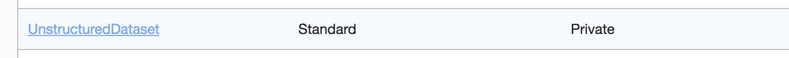
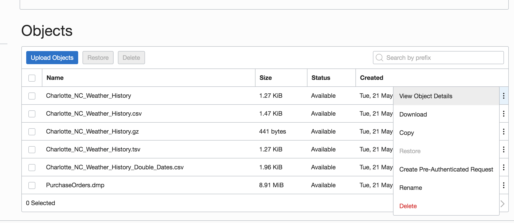
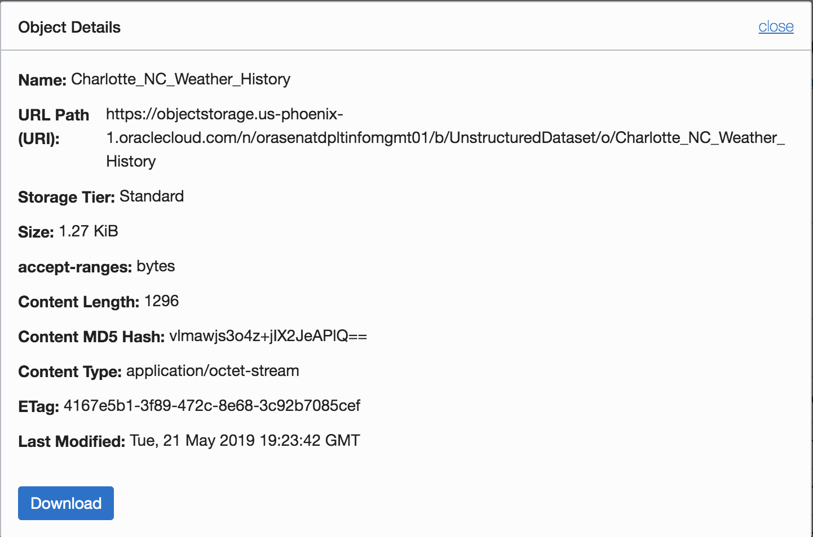
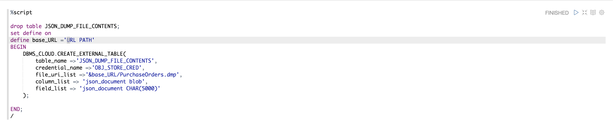
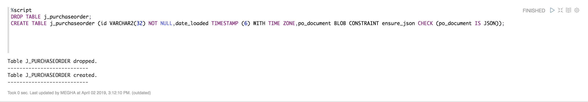
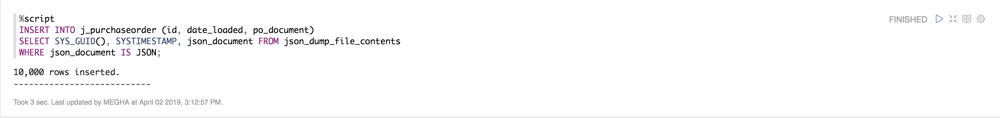
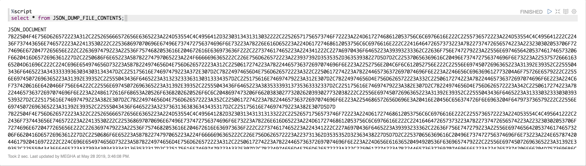
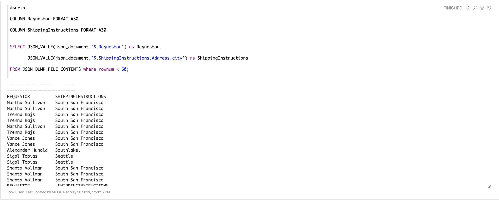
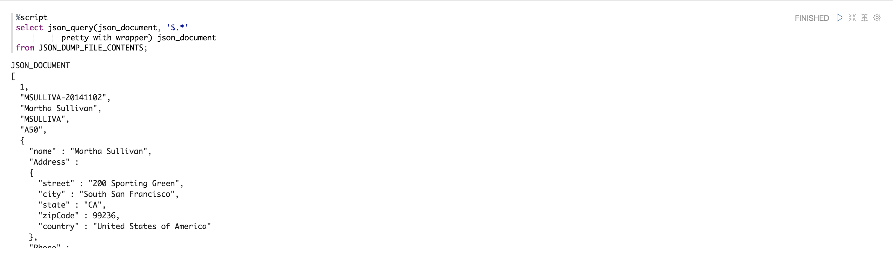
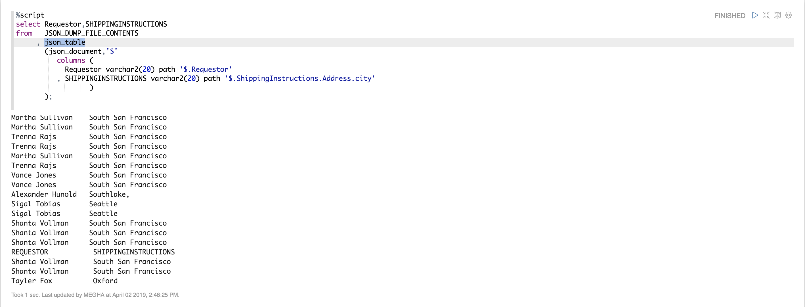

Updated: December 10, 2018

JSON data has often been stored in NoSQL databases such as Oracle NoSQL Database and Oracle Berkeley DB. These allow for storage and retrieval of data that is not based on any schema, but they do not offer the rigorous consistency models of relational databases.
To compensate for this shortcoming, a relational database is sometimes used in parallel with a NoSQL database. Applications using JSON data stored in the NoSQL database must then ensure data integrity themselves. Plus, SQL and relational databases provide flexible support for complex data analysis and reporting, as well as rock-solid data protection and access control. This is typically not the case for NoSQL databases, which have often been associated with schemaless development with JSON in the past. 
Native support for JSON by Oracle Database obviates such workarounds. It provides all of the benefits of relational database features for use with JSON, including transactions, indexing, views and declarative querying, for example in Oracle Database you can use SQL to join JSON data with relational data. And you can project JSON data relationally, making it available for relational processes and tools. You can also query, from within the database as well as JSON data that is stored outside Oracle Database in an external table.
And, you can access JSON data stored in the database the same way you access other database data, including using OCI, .NET, and JDBC.

In Oracle Database, JSON data is stored using the common SQL data types VARCHAR2, CLOB, and BLOB (unlike XML data, which is stored using abstract SQL data type XMLType). 

## Objectives

1. Create an External table in Autonomous Database from JSON dump file. 
2. Create an internal table with a JSON column with an ”is json” check constraint. Oracle recommends that you use an is_json check constraint to ensure that column values are valid JSON instances. 
3. Insert JSON data from the external table into the column of internal table, and 
4. Query the JSON data.

## Required Artifacts

- An oracle cloud account with Autonomous Data Warehouse Cloud Service.

### **STEP 1**: Create an External table in Autonomous Database from JSON dump file.

External table procedure allows you to query data that is stored outside the database in flat files. You can also store these files in either Oracle’s Object Storage, Amazon S3 or Microsoft Azure Blob. This allows you to run queries on external data from Autonomous Data Warehouse.
Using JSON data can be as simple as putting each JSON document into a table row as a BLOB, and using the powerful JSON features that the Oracle Database provides to parse and query it. 

- Navigate to the object storage and click on **UnstructuredDataset**, the object storage you have created for the lab.

      

- Click on the hamburger menu in front of one of the files. Click on **View Object Details**

      
  
- Copy the URL PATH.

      

- Go back to the Notebook and paste this URL link in the JSON script where it says "URL PATH", replace that with the copied URL and run it. 

      
  
  Let us breakdown and understand this script. We are invoking the “CREATE_EXTERNAL_TABLE” procedure in the DBMS_CLOUD API  package. We are then providing the table name we want in our Data Warehouse, our user credentials (we created this in the pre-requisites), the object store file list that contains our data, a format JSON object that describes the format of our file to the API, and a list of named columns for our destination table.

### **STEP 2**: Create an internal table with a JSON column with an ”is json” check constraint.

Now, we will create a table with a primary-key column and a JSON column, and add an is json check constraint to ensure that the JSON column contains only well-formed JSON data.

- Go to your notebook and click on the run button for the Script.  
    
  

### **STEP 3**: Insert JSON data from the external table into the column of internal table.

- For better performance on large JSON data files, using the previously created external table we can also make use of the Database’s JSON features to parse and insert the JSON data into a new table ‘j_purchaseorder’ ahead of time, as below. 
  Note that this insert statement actually brings the data into your ADW instance. You benefit from doing this as it checks to make sure your JSON data is well-formed and valid ahead of time, and therefore incur less of a performance impact when you query this JSON data from your ADW instance.
 
  

### **STEP 4**: Query the JSON data.

The return value is always a VARCHAR2 instance that represents a JSON value. Here are different ways to query a JSON data with some simple examples.

- **Simple Query**

  The easiest way to retrieve JSON data from Oracle is via simple SQL, the kind you’d write even if there were no JSON in the picture. A little extra work has to be done if the JSON needs to be translated to relational form or filtered based on certain conditions. That’s where SQL/JSON query functions and dot notation come in
  Run the script to see the data stored in the external table. 

      
 
- **JSON_VALUE**

  Oracle SQL function json_value selects a scalar value from JSON data and returns it as a SQL value.
  For more information, refer to this site: https://docs.oracle.com/database/121/ADXDB/json.htm#ADXDB6263

      

- **JSON_QUERY**

  JSON_QUERY finds one or more matching values in JSON data and returns it to SQL as a string. JSON_QUERY can be used to retrieve fragments of a JSON document.
  If JSON_QUERY returns scalar values or multiple values, it needs a WITH WRAPPER clause – this encloses the output in an array wrapper (i.e. square brackets []).
  The effect of keyword PRETTY is to pretty-print the returned data, by inserting newline characters and indenting. The default behavior is not to pretty-print.

      

- **JSON_TABLE**

  Oracle SQL function json_table projects JSON data into a relational format. You use json_table to decompose the result of JSON expression evaluation into the relational rows and columns of a new, virtual table, which you can also think of as an inline relational view.

      